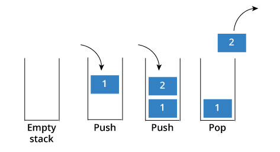
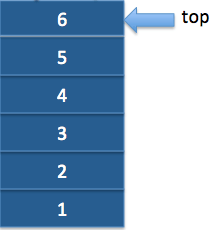
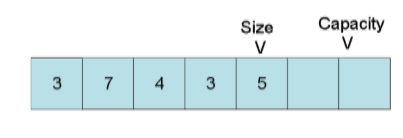

# Implementing a Stack on a Dynamic Array
### Built With
* [Microsoft Visual Studio](https://visualstudio.microsoft.com/pl/) - IDE
* [C99](https://en.wikipedia.org/wiki/C99) - C Language Standard

###

[](https://github.com/github99er/DynamicArrayStack/blob/master/dynamicArray.c)


# Introduction to Stack Data Structure

A stack is a container abstraction that maintains elements in order based on their time of insertion. In a stack abstraction, the only element that is accessible is the topmost element. Every time an element is inserted into the stack, the previous element becomes in-accessible while the new element becomes the top. Only the topmost element can be removed from a stack.

### Operations of a Stack:

| Behavior | Description |
| ------ | ------ |
| Push | Inserts new element to top of the stack |            
| Pop | Removes element at top of the stack |   
| Top | Returns element at top of the stack |
| Empty| Checks if elements are in the stack |

### Visual of Stack Operations:      

           |  
:-------------------------:|:-------------------------:
### Real Life Stack Examples:
```sh
 1. Stack of plates     2. Stack of glasses     3. Tennis ball packaging     4. Paper in a printer
```
# Introduction to Static Array & Dynamic Array

### Array Properties:
| Property | Description |
| ------ | ------ |
| Size | The number of elements in the array at a given time  |
| Capacity | The number of elements the array can hold at a given time |

### Visual of Array Properties:
    

A **static array** is a container abstraction designed to hold a collection of elements that allows quick access to an element in the container. A static array has a fixed capacity which must be specified upon creation. 

A **dynamic array** is an extension of the static array, the difference being the capacity of the array is dynamically updated at program runtime. Allocation at runtime allows for only necessary memory to be allocated.

### Why use a dynamic array?
- Using a dynamic array prevents overallocation of program memory
- If overallocated, then program runs slower than necessary

# Implementation and Interface

- This implementation defines a dynamic array as a structure of type DynArr
- Header File Reference(s) → [TYPE](dynArray.h)
```sh
struct DynArr
{
	TYPE *data;	/* pointer to the array containing data */
	int size;	/* Number of elements in the array */
	int capacity;	/* capacity of the array */
};

```


### Dynamic Array Interface (important method(s) only):
```sh
void _dynArraySetCapacity (struct DynArr * da)
→ Given a pointer (da) to a dynamic array, double the dynamic array’s current capacity
```


### Stack Interface:


```sh
void dynArrayPush (struct DynArr * da, TYPE e) 
→ Given a value (e), add (e) to the top (rightmost) index of a dynamic array given the dynamic array's pointer (da)
→ Calls _dynArraySetCapacity when attempting to push to a dynamic array at full capacity

TYPE dynArrayTop (struct DynArr * da) 
→ Given a pointer (da) to a dynamic array, return the top (rightmost) element of the dynamic array

void dynArrayPop (struct DynArr * da) 
→ Given a pointer (da) to a dynamic array, remove the top (rightmost) index of the given dynamic array

int dynArrayIsEmpty (struct DynArr * da) 
→ Given a pointer (da) to a dynamic array, return 1 if the dynamic array contains zero elements and return 0 if not
```

### Compiling Methods Used

```sh
$ gcc -Wall -std=c99 -o filename filename.c 

Wall = show all warnings
std=c99 = ANSI standardized version of C99

```
### Contributor

* **Ryan Murphy** - [Github99er](https://github.com/Github99er)

##

