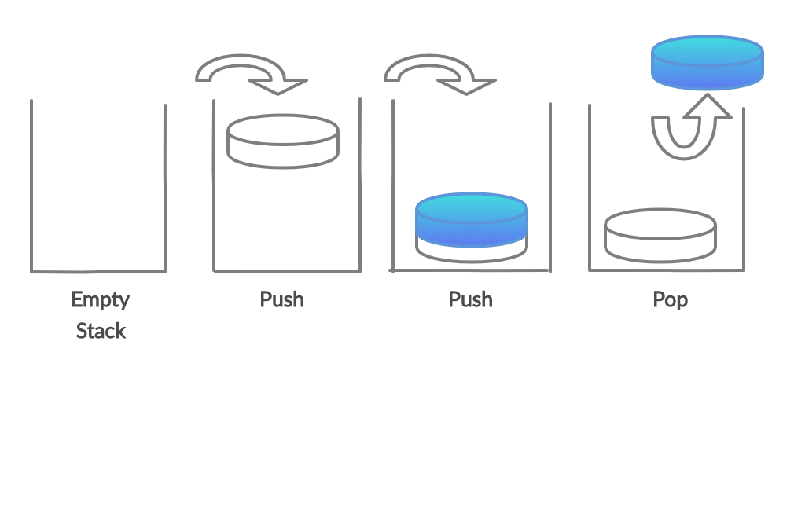
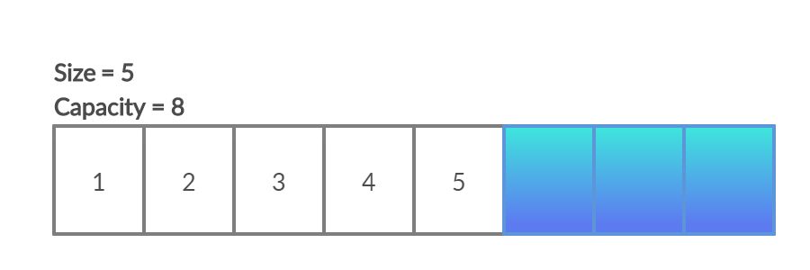
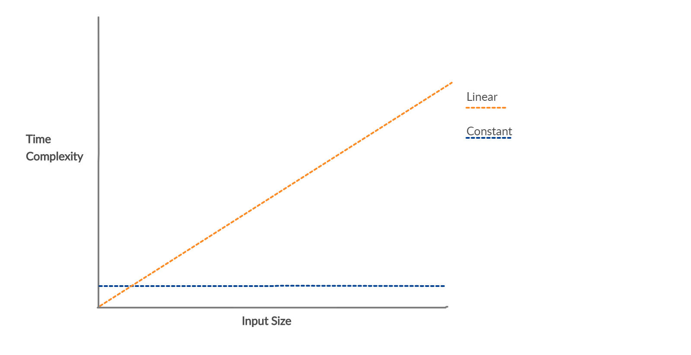
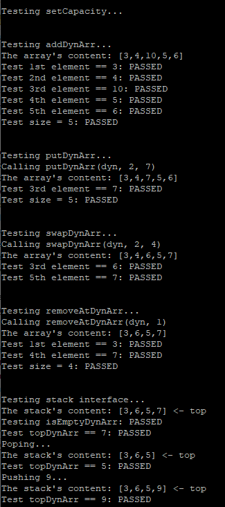

# Implementing a Stack on a Dynamic Array
### Built With
* [Microsoft Visual Studio](https://visualstudio.microsoft.com/pl/) - IDE
* [C99](https://en.wikipedia.org/wiki/C99) - C Language Standard

###


### Introduction to Stack Data Structure:

A stack is a container abstraction that maintains elements in order based on their time of insertion. In general, a container is defined as a collection of elements. Stacks are primarily used when order of insertion, or removal of elements into a collection is important. In a stack abstraction, the only element that is accessible is the topmost element. 


Every time an element is inserted into the stack, the previous element becomes in-accessible while the new element becomes the top. Only the topmost element can be removed from a stack.

### Operations of a Stack:

| Behavior | Description |
| ------ | ------ |
| Push | Inserts new element to top of the stack |            
| Pop | Removes element at top of the stack |   
| Top | Returns element at top of the stack |
| IsEmpty| Checks if elements are in the stack |

### Visual of Stack Operations:      

           |  
:-------------------------:|:-------------------------:
### Real Life Stack Examples:
```sh
 1. Back Button 
 
 2. Stack of plates 
 
 3. Stack of glasses    
 
 4. Tennis ball packaging  
 
 5. Paper in a printer 
```
### Introduction to Static Array & Dynamic Array:


| Array Properties | Description |
| ------ | ------ |
| Size | The number of elements in an array at a given time  |
| Capacity | The number of elements an array can hold at a given time |

A **static array** is a container abstraction designed to hold a collection of elements that allows quick access to an element in the container. A static array has a fixed capacity which must be specified upon creation. 

A **dynamic array** is an extension of the static array, the difference being the capacity of the array is dynamically updated at program runtime. Runtime is the time it takes for a processor to execute machine level code. Allocation at runtime allows for only necessary memory to be allocated.

### Visual of Array Properties:
    


### Why use a dynamic array?
- Using a dynamic array prevents overallocation of program memory
- If overallocated, a program runs slower than necessary

### Dynamic Array Speed Limitation:
The time it takes for an operation to execute is described as time complexity. The stack operation's pop, top, and IsEmpty share the same time complexity regardless of if they are implemented onto a dynamic, or static array. The time complexity these operations share is constant time. Constant time is essentially the fastest execution time an operation can have.

For a dynamic array to correctly update capacity, a temporary array must be created with the updated capacity. Then the intial array's elements must be copied into the temorary array. Finally, the temporary array replaces the intial array. This causes a push operation on a dynamic array with a full capacity to execute at linear time. Linear time is slower than constant time, however, a dynamic array's push operation only runs at linear time when capacity is equivalent to size. On average, push will execute at constant time, but has the chance to execute at linear time.




# Implementation and Interface:

- This implementation defines a dynamic array as a structure of type DynArr
- A pointer is an address that points towards a specific value, or in this case element
- Header File Reference(s) → [TYPE](dynArray.h)
```sh
struct DynArr
{
	TYPE *data;	/* pointer to the array containing data */
	int size;	/* Number of elements in the array */
	int capacity;	/* capacity of the array */
};

```


### Dynamic Array Interface:
```sh

void dynArrayInit (struct DynArr * da, int initialCapacity)
→ Given a pointer (da) to a dynamic array, initalize the dynamic array's capacity to initialCapacity

void _dynArraySetCapacity (struct DynArr * da)
→ Given a pointer (da) to a dynamic array, double the dynamic array’s current capacity

void dynArrayFree (struct DynArr * da)
→ Given a pointer (da) to a dynamic array, free the memory allocated for the dynamic array

int dynArraysize (struct DynArr * da)
→ Given a pointer (da) to a dynamic array, return how many elements are in the dynamic array

void dynArrayAdd (struct DynArr * da, TYPE e)
→ Given a pointer (da) to a dynamic array, and a value (e), insert (e) at the end of the dynamic array

void dynArrayRemoveAt (struct DynArr * da, int position)
→ Given a pointer (da) to a dynamic array, remove the value stored at position

TYPE dynArrayGet (struct DynArr * da, int position)
→ Given a pointer (da) to a dynamic array, return the element stored at position

void dynArrayPut (struct DynArr * da, int position, TYPE value)
→ Given a pointer (da) to a dynamic array, and a value (e), insert (e) into the dynamic array at position
```


### Stack Interface:


```sh
void dynArrayPush (struct DynArr * da, TYPE e) 
→ Given a value (e), add (e) to the top (rightmost) index of a dynamic array given the dynamic array's pointer (da)
→ Calls _dynArraySetCapacity when attempting to push to a dynamic array at full capacity

TYPE dynArrayTop (struct DynArr * da) 
→ Given a pointer (da) to a dynamic array, return the top (rightmost) element of the dynamic array

void dynArrayPop (struct DynArr * da) 
→ Given a pointer (da) to a dynamic array, remove the top (rightmost) index of the given dynamic array

int dynArrayIsEmpty (struct DynArr * da) 
→ Given a pointer (da) to a dynamic array, return 1 if the dynamic array contains zero elements and return 0 if not
```

### Compiling Methods Used:

```sh
$ gcc -Wall -std=c99 -o filename filename.c 

Wall = show all warnings
std=c99 = ANSI standardized version of C99

```


| [](https://github.com/github99er/DynamicArrayStack/blob/master/dynamicArray.c) | **Sample Case Outputs** |
| ------ | ------ |
| [](https://github.com/github99er/DynamicArrayStack/blob/master/testDynArray.c)   | |            
### Contributor

* **Ryan Murphy** - [Github99er](https://github.com/Github99er)

##

